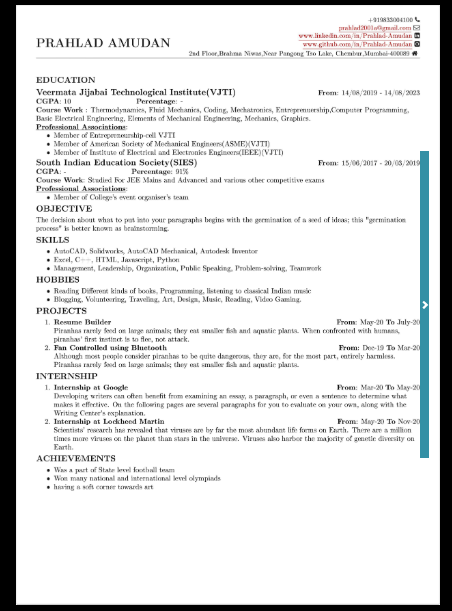
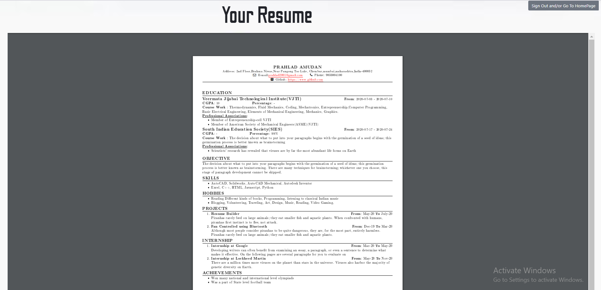
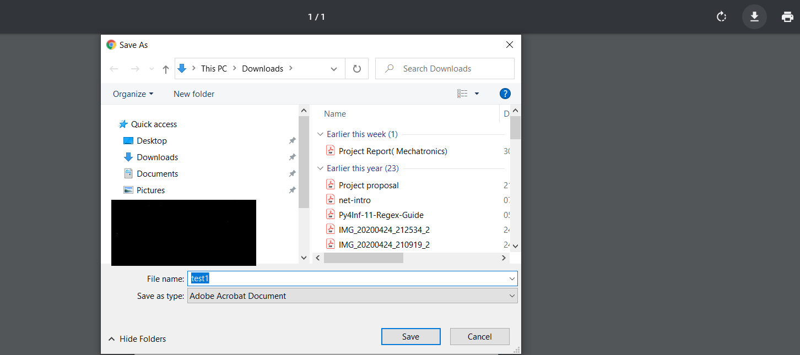

# Resume Maker

## Team name : NXT-Debuggers

## Team members 
* Sameep Kulkarni - kulsameep325@gmail.com
* Karthik Swaminathan - karthikswami.1802@gmail.com
* Chaitanya Apte -  chaitanya902@gmail.com
* Prahlad Amudan - prahlad2001a@gmail.com

## Mentors
* Vedant Paranjape
* Abhay Kaul
* Devanshi Shah

## Description 

### Our project is a web-based app.This app aims to provide a simple and professional resume for the user.The app can be mainly divided into 4 pages : [Homepage](#Homepage) , [Template Page](#Template-Page) ,[Input Page](#Input-Page) , [Resume Viewing page](#Resume-Viewing-Page).

> ### Homepage

The Homepage mainly consists of:
1. A navbar with four buttons(nav-pills) and the app icon.

    1. Home : Displays the homepage.

    2. Make Resume :This button will redirect the user the page to select templates.

    3. My Resume (Work in progress) :There will be a button for log in and a button for sign up.   (_This is for users who have provided their email id and have logged in._) The user will be able to see his/her previously made resume (if any) and edit it.Else will receive a message "**You have no previously made resume**" and a button "***Make Resume Now***" will be displayed.
    
    4. About Us : It gives a brief description about the project and our motive.There is also a button "***More about the creators***" which opens four collapsible bootstrap cards which provide further information about the team members and a clickable icon of LinkedIn which will redirect the user to the LinkedIn profile of that particular team member,in another tab.

    

1. A slideshow displaying the available resume templates.We currently have provided four resume templates.
   

2. A footer containing the link to a google feedback form .
    

> ### Template Page

The Template page consists of four different templates      (which can be seen in the homepage as well) where you will have the miniaturised version of the templates which are clickable.On clicking you a readable version of the template will be displayed with a  "***Select Template***" button, a "***Close***" button and another button close button with the "**x**" symbol . After clicking on "***Select Template***" a collapsible button  "***go to input page***" wil appear which on clicking will direct you to the input page.

> ### Input Page

This is page where the user will provide details which he/she wants to be displayed in his/her resume.

 
 

> ### Resume Viewing Page
 
The LaTeX generated pdf of resume will be shown here with option to download and a button at the top to redirect you to the homepage after completing the downloading part.

In the above image as you can see the "***Sign Out and/or Go to Home Page***" will redirect you to the homepage

By Clicking on "**Download**" icon you would get a dialog box where you can save pdf on your device(*This is for the user who use Chrome browser*) 

After downloading you get a box with downloaded pdf at the bottom of your page in Chrome

* GitHub repo link : https://github.com/kart1802/NXT-Debuggers.git

* Drive link : https://drive.google.com/file/d/1srH3y6iCzH47jSsj_mRIcSy3rPsRCZKc/view?usp=sharing

 

## Technology Stack

* HTML
* CSS
* Javascript
* Bootstrap 4
* Python
* Flask
* LateX
* PostgreSQL

## Project Setup
    
1. Download [MikTex](https://miktex.org/download) (Install all packages that are prompted by Texworks).
2. Download [TexMaker](https://www.xm1math.net/texmaker/download.html) (Recommended Text-Editor) .
3. Download [Python](https://www.python.org/downloads/) .

    In the command prompt enter the follwing code
    *  ` pip install Flask `
    *  ` pip install -r requirements.txt `
  

## Usage
1. **User enters the Homepage:**
    1.To make a resume
    
    * If on PC : Click on the "Make Resume" button in the navbar or the "Make your professional resume now!" button below the slideshow.
    * If on Mobile: Open the collapsible navbar by clicking the button to the top-right corner after which click the "Make Resume" button or the "Make your professional resume now!" button below the slideshow.

    * If you want to know About the project and the creators

        * If on PC :click on the "About Us" button in the navbar.A brief description about the project and the team will be displayed along with a button which opens a collapsible tab which on clicking will provide further information about the team.
        * If on Mobile: Click the the button on the top-right corner of the homepage to open a collapsible navbar.Click on the "About Us" button and the same contents as above will be displayed.
---
2. **User enters the Template Page:**
    1. There will be four miniaturised versions of the resume temlpates which will be clickable.
    On clicking any of the four boxes , a readable version of that particular resume template will be displayed.This readable image will also come with "x" button in the top-right corner to close it as well as a "close" and "Select Template" button after the image of the template.
    2. On clicking the "Select Template" button ,a collapsible "Go to Input Page" button which on clicking will direct the user to the Input Page.
---
3. **User enters the template page:**\
        There will be totally about 30 primary input fields in which the number of some input fields can be increased if required.These input fields are divided into parts and will be displayed,on pressing the "next" button, in a certain order .The user can go back and forth between these parts using the "back" and "next" button respectively.

    1. **Personal Details** : This contains details like the name ,contact , email id and residential address of the user.All these input put fields are compulsory and one filling each one of them only will the user be able to use the "next" button to give further details.

    2. **Education** : The user can have at maximum Four Education fields and can add/remove the required education using the "Add Education"/"Remove Education" button.Each education field has input fields such as Name of Institute,year of admission,year of graduation,cgpa/percentage,core classes.There is also an input field named Achievements/Associations which can at maximum have four entries under itself.The Achievements/Associations can be added/removed using add/remove buttons similar to education fields.Each education field will at maximum take 4 achievements.Under education certain input fields are compulsory and the "next" button will not work unless they are filled.Those input fields are Name of Institution,Admission Year,Year of Graduation,Core Classes.

    3.  1. **Objective** : this input field requires an input of about 2-3 lines and is compulsory. So,the "next" button will not work unless its filled.
        2. **Skills** : Under this the user can at maximum give 10 entries.The user can add/remove the required skill using a similar add/remove button like in previous input fields.
        3. **Hobbbies** : Under this input field the user can give 10 at maximum.The "Add"/"Remove" button can be used when necessary.
    4. **Project**: This contains four input fields namely : Project Title,Start Date,End Date,Project Description.There can be at maximum 4 project entries.And the number of can be added
    or removed using the add/remove buttons.

    5. **Internship** : This contains four input fields namely : Internship Title,Start Date,End Date,Internship Description.There can be at maximum 4 Internship entries.The number of can be added
    or removed using the add/remove buttons.

   6.  
        1. **Other Achievements** : There can be at maximum 5 entires.The number of entries can be increased or decreased using a similar add/remove achievement button like in the input fields above.
      2. **Profile Links**
            * LinkedIn Profile : Here the user can enter his/her LinkedIn Profile Link if available.
            * GitHub Profile : Here the user can 
            enter the link of his/her GitHub profile if available.

## Applications
> Our Resume Maker will be useful in providing simple and professional resumes to our users and to enable those users who have no idea about the format of a resume to also make a resume for themselves.

## Future Scope
> Our project is primarily made for undergraduate or graduate students to help them make a professional resume. As of now, our Resume Maker app has 4 resume templates for the users. We would like to add more in future. Further, we are working on making the whole app more responsive,easy to use and giving the logged in users the opportunity to edit or download their previously made resumes.One of our future plans will be to have a feature which will ask the registered users to provide the companies they would like to send a particular resume to, and that resume would be sent to the respective company's mail id by our app.  

